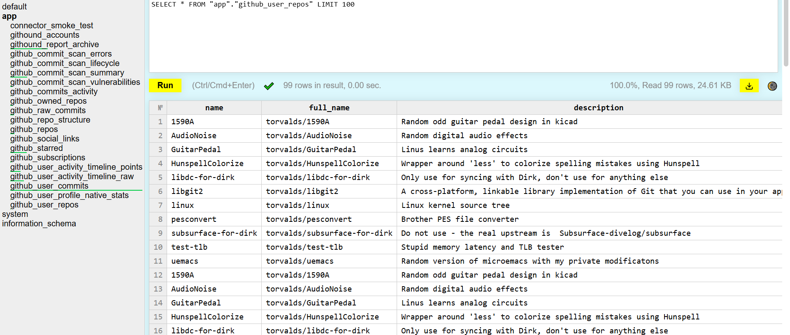
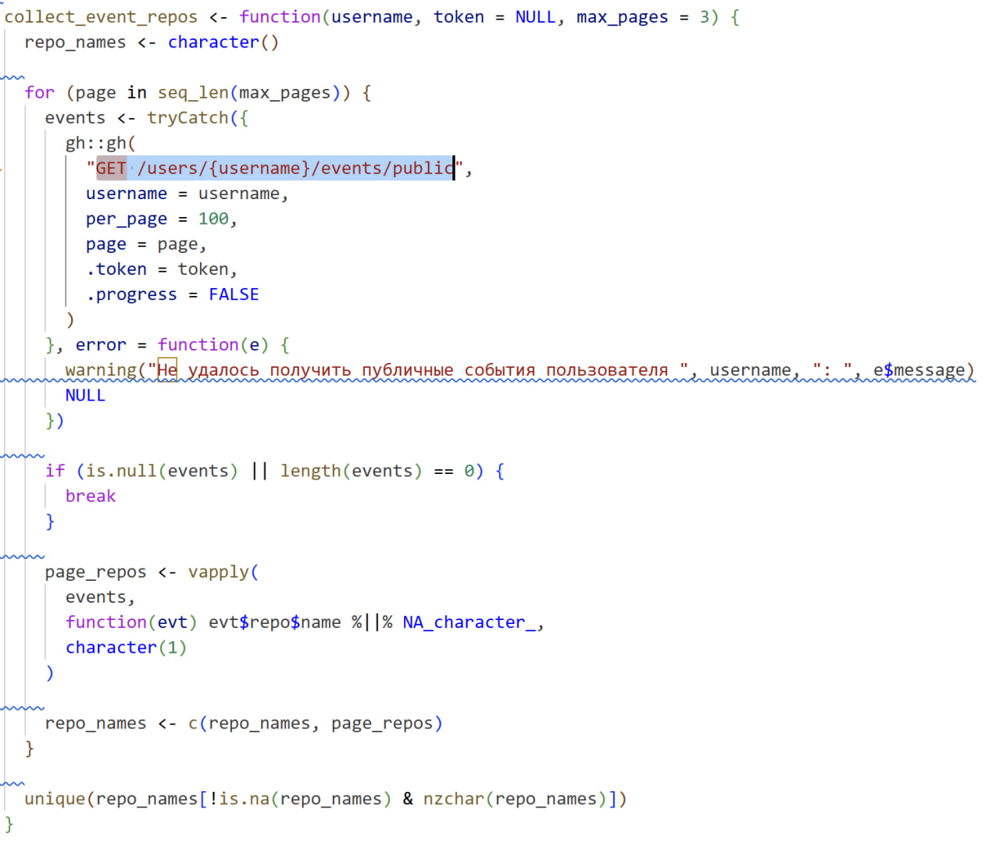

##  {background-color="#F3F1ED"}

:::: {style="position: relative; display: flex; flex-direction: column; justify-content: center; height: 100%;"}

<h1 style="font-size: 3em; color: #095bb8; margin-bottom: 20px;">

Анализ Git репозиториев
</h1>

`
`{=html}
Создание поведенческого профиля разработчика, анализ аномалий

::: {style="text-align: right; margin-top: 20px;"}

Заргаров А.Д.

Миронов П.Э.

Соколова М.М.

:::
::::

---

## Архитектура ETL-модуля

:::: {.columns}

::: {.column width="33%"}

### Источники

**GitHub API**  
Аккаунт, репозитории, коммиты, участие  

**OSV API**  
Уязвимости  

:::

::: {.column width="33%"}

### Обработка

- Очистка данных  
- Нормализация  
- Обогащение  
- Валидация  

:::

::: {.column width="33%"}

### Хранилище

**ClickHouse**  
Данные, связанные с пользователем (OLAP, аналитика)  

**MongoDB**  
Данные об уязвимостях (гибкая схема, вложенные структуры) 

:::

::::

---

## Что собираем из GitHub

| Категория | Данные |
|---------|----------|
| **Аккаунт** | login, name, bio, location, created_at, followers, following, public_repos |
| **Репозитории** | name, stars, forks, watchers, language, size, created/updated_at |
| **Коммиты** | hash, date, message, additions, deletions, files_changed |
| **Участие** | repo_name, role(contributor), total_commits, first_contribution, last_contribution |

---

## Пример реализации в ClickHouse

  

---

## Сбор уязвимостей из OSV

### Подход

- Первично выгружаем **всю базу данных OSV**  
- **Регулярно** выгружаем инкремент относительной нашей БД

### Особенности

- Преобразуем данные в удобную структуру  
  (нормализация, выделение пакетов, версий, экосистем)  
- Строим связи: пакет → версия → уязвимость  
- Кэшируем данные в **MongoDB** 
- Исключаем зависимость от внешнего API во время анализа

----

::: {style="display: flex; flex-direction: column; justify-content: center; align-items: center; height: 100%;"}
<h1 style="font-size: 3em; color: #095bb8; text-align: center; margin-bottom: 20px;">

Спасибо за внимание!

</h1>

Будем рады ответить на ваши вопросы

:::
---

## Пример извлечения данных из GitHub

Пример функции на R для получения публичных событий пользователя через GitHub API

